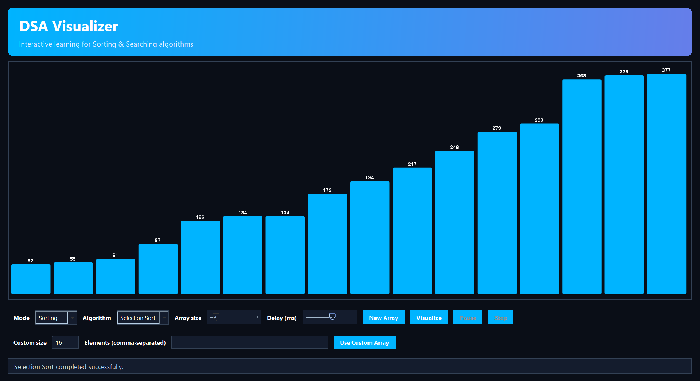

<div align="center">

# 📊 Java DSA Visualizer — Real-Time Algorithm Animation Suite

### *High-Performance, Frame-by-Frame Interactive Visualizer for Searching & Sorting Algorithms in Pure Java*

[](https://www.oracle.com/java/)
[](https://docs.oracle.com/javase/tutorial/uiswing/)
[](src/main/java/com/pradeep/dsaviz/)
[](LICENSE)

<p align="center">
  A responsive desktop visualizer engineered in Java Swing & Graphics2D.<br />
  Watch algorithm state changes, pivot partitions, pointer convergence, and element swaps unfold with customizable delays and color-coded telemetry.
</p>

</div>

---

## 📸 Application Preview

<div align="center">
  
  <p><em>Real-time Selection Sort execution on a custom array size with dynamic speed controls and step-by-step progress tracking.</em></p>
</div>

---

## 📋 Table of Contents
- [Application Preview](#-application-preview)
- [Overview](#-overview)
- [Supported Algorithms & Complexities](#-supported-algorithms--complexities)
- [Interactive Features & Controls](#-interactive-features--controls)
- [Architecture & Rendering Pipeline](#-architecture--rendering-pipeline)
- [Quick Start Guide](#-quick-start-guide)
- [Repository Structure](#-repository-structure)
- [License & Copyright](#-license--copyright)

---

## 💡 Overview

Abstract algorithm mechanics—like in-place partitioning in QuickSort, auxiliary array merging in MergeSort, or binary search interval halving—are best comprehended visually. 

**Java DSA Visualizer** provides a smooth, real-time animation canvas with dedicated worker threads, ensuring the UI remains 100% responsive while animating heavy computational sorts across hundreds of elements.

---

## ⚡ Supported Algorithms & Complexities

| Algorithm | Category | Best Time | Average Time | Worst Time | Space Complexity | Visual Indicators |
| :--- | :--- | :--- | :--- | :--- | :--- | :--- |
| **Bubble Sort** | Comparison Sort | $\mathcal{O}(N)$ | $\mathcal{O}(N^2)$ | $\mathcal{O}(N^2)$ | $\mathcal{O}(1)$ | 🔴 Comparing Adjacent, 🟢 Placed Element |
| **Selection Sort** | Selection Sort | $\mathcal{O}(N^2)$ | $\mathcal{O}(N^2)$ | $\mathcal{O}(N^2)$ | $\mathcal{O}(1)$ | 🟡 Current Minimum, 🔵 Scan Pointer |
| **Insertion Sort** | Insertion Sort | $\mathcal{O}(N)$ | $\mathcal{O}(N^2)$ | $\mathcal{O}(N^2)$ | $\mathcal{O}(1)$ | 🟣 Shifting Element, 🟢 Sorted Prefix |
| **Merge Sort** | Divide & Conquer | $\mathcal{O}(N \log N)$ | $\mathcal{O}(N \log N)$ | $\mathcal{O}(N \log N)$ | $\mathcal{O}(N)$ | 🟠 Subarray Splits, 🟢 Merged Elements |
| **Quick Sort** | Divide & Conquer | $\mathcal{O}(N \log N)$ | $\mathcal{O}(N \log N)$ | $\mathcal{O}(N^2)$ | $\mathcal{O}(\log N)$ | 🔵 Pivot Element, 🔴 Left/Right Pointers |
| **Heap Sort** | Selection Sort | $\mathcal{O}(N \log N)$ | $\mathcal{O}(N \log N)$ | $\mathcal{O}(N \log N)$ | $\mathcal{O}(1)$ | 🟡 Max-Heapify Sift, 🟢 Extracted Root |
| **Binary Search** | Searching | $\mathcal{O}(1)$ | $\mathcal{O}(\log N)$ | $\mathcal{O}(\log N)$ | $\mathcal{O}(1)$ | 🟣 Midpoint, ⚪ Discarded Range, 🟢 Found |
| **Linear Search** | Searching | $\mathcal{O}(1)$ | $\mathcal{O}(N)$ | $\mathcal{O}(N)$ | $\mathcal{O}(1)$ | 🔵 Scanning Index, 🟢 Target Found |

---

## 🎛️ Interactive Features & Controls

- ⏯️ **Playback Controller**: Dedicated Run, Pause, Single-Step Forward, and Cancel/Reset controls.
- 🎚️ **Dynamic Scale & Speed**:
  - **Dataset Size Slider**: Scale from 10 elements up to 200 elements in real time.
  - **Animation Speed Slider**: Granular delay tuning from 5ms ultra-fast execution to 500ms slow-motion step tracing.
- 🎲 **Dataset Generators**:
  - **Random Distribution**: Uniform randomized array.
  - **Nearly Sorted**: Simulates real-world semi-sorted inputs.
  - **Reversed Order**: Demonstrates worst-case algorithm behaviors.
  - **Heavy Duplicates**: Tests stability and duplicate handling.
- 📈 **Real-Time Telemetry**: Real-time counter tracking total array comparisons and element swaps.

---

## 🏗️ Architecture & Rendering Pipeline

```
+-------------------------------------------------------------+
|                     Swing Event Dispatch Thread (EDT)       |
|    - Top Control Toolbar (Combo boxes, Buttons, Sliders)    |
|    - VisualizerFrame & Custom BarPanel Canvas               |
+-------------------------------------------------------------+
                               ▲
                               │ Repaint signals (SwingUtilities.invokeLater)
                               │
+-------------------------------------------------------------+
|                 Background Animation Worker Thread          |
|    - Executes Sorting / Searching Algorithm                 |
|    - Thread.sleep(animationSpeed) for timing control         |
|    - Dispatches state updates (highlights, pointers, swaps) |
+-------------------------------------------------------------+
```

---

## 🚀 Quick Start Guide

### Prerequisites
- Java Development Kit (JDK 17 or higher) installed and configured on your system.

### Build & Run

```powershell
# 1. Clone the repository
git clone https://github.com/Pradeep-B28/JAVA-Searching-Sorting-Visualizer.git
cd JAVA-Searching-Sorting-Visualizer

# 2. Compile Java source files to out/ directory
javac -d out src/main/java/com/pradeep/dsaviz/*.java

# 3. Launch the Application
java -cp out com.pradeep.dsaviz.DSAVisualizerApp
```

---

## 📁 Repository Structure

```text
JAVA-Searching-Sorting-Visualizer/
├── src/main/java/com/pradeep/dsaviz/
│   ├── DSAVisualizerApp.java          # Application entry point & UI setup
│   └── VisualizerFrame.java           # Custom Graphics2D rendering engine & sorting algorithms
├── out/                               # Compiled class binaries (git-ignored)
├── Screenshot.png                     # Application screenshot
├── LICENSE                            # MIT License with copyright
└── README.md                          # Documentation & complexity guide
```

---

## 📄 License & Copyright

```
Copyright (c) 2026 Pradeep (Pradeep-B28). All Rights Reserved.

Licensed under the MIT License. You may freely use, modify, and distribute
this project under the terms of the MIT license. See the LICENSE file for details.
```

Engineered with ☕ by **[Pradeep](https://github.com/Pradeep-B28)**.
